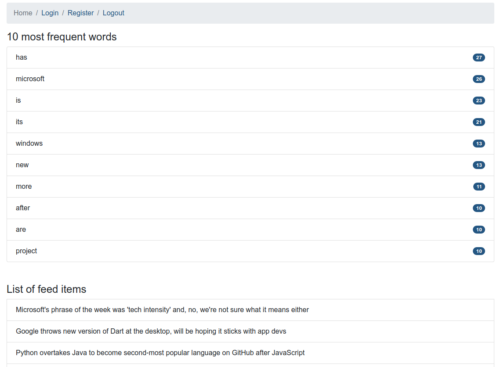

# Mintos PHP assesment
Your task is to create simple RSS reader web application with requirements described in the separate document



### Requirements of the assesment:
- User registration - form with e-mail and password fields + e-mail verification using ajax.
- Login form with e-mail address and password
- RSS feed view

### Technologies used in the assesment
- Symfony 4.3
- Vue.js
- Docker
- Docker Compose
- PHP 7.3.10
- PhpUnit 7.5.17
- Bash
- Git
- Bootstrap
- Node.js
- Yarn

### Prerequisites
Docker.io and docker-compose must be installed in the system in order to be able to use the app.
OS Linux

## How to setup the application:
```bash
git clone https://github.com/belushkin/mintos.git
cd mintos; ./toolbox.sh up
./toolbox.sh exec php bin/console doctrine:migrations:migrate
./toolbox.sh exec php bin/console doctrine:fixtures:load
./toolbox.sh exec yarn install
./toolbox.sh exec yarn encore dev
```

## Default user added from fixtures
example@email.ua

## How to run tests
```bash
./toolbox.sh tests
```

### URL of the running app
http://localhost:8000/

http://localhost:8080 (adminer)

- server: db-mysql
- username: root
- password: root
- db: mintos


## Basic script usage:
Application has *toolbox.sh* script. It is very easy run, stop, ssh, rebuild, run tests and stop the application.

```bash
./toolbox.sh up # run the application
./toolbox.sh rebuild # rebuild the image
./toolbox.sh ssh # ssh to the container
./toolbox.sh tests # run tests
./toolbox.sh down # stop the application
```

## Contributors
@belushkin

## License
MIT License
